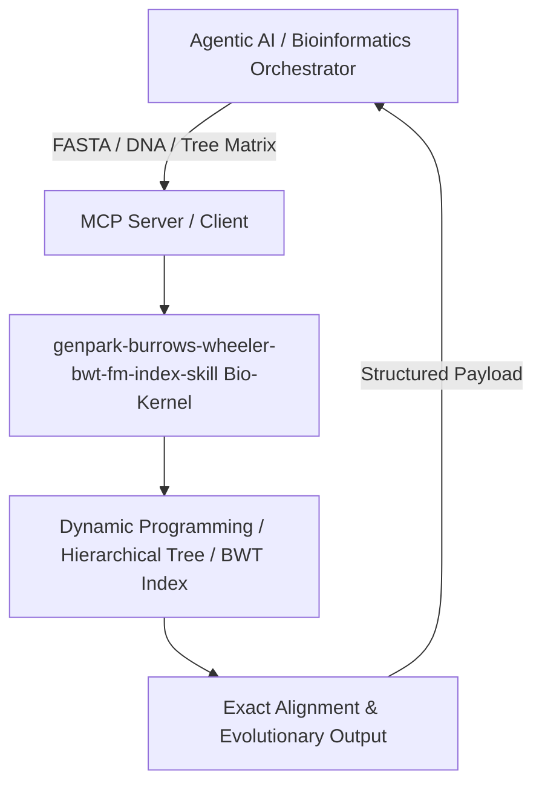

# genpark-burrows-wheeler-bwt-fm-index-skill

[](https://github.com/alphaparkinc/genpark-burrows-wheeler-bwt-fm-index-skill)
[](https://python.org)
[](#)
[](#)
[](LICENSE)

> Burrows-Wheeler Transform (BWT) and FM-index compression engine enabling ultra-fast exact substring and genome read mapping in sublinear time.

## Architecture Overview



## Features
- **0 External Pip Dependencies**: Pure Python standard library implementation.
- **MCP Protocol Ready**: Includes Model Context Protocol server script (`mcp_server.py`).
- **Production Standard**: Comprehensive biochemical test cases, ultra-fast DP matrices.

## Quick Start
```bash
python example_usage.py
```
